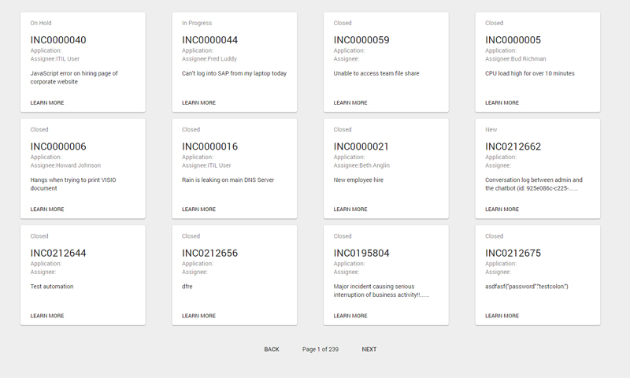
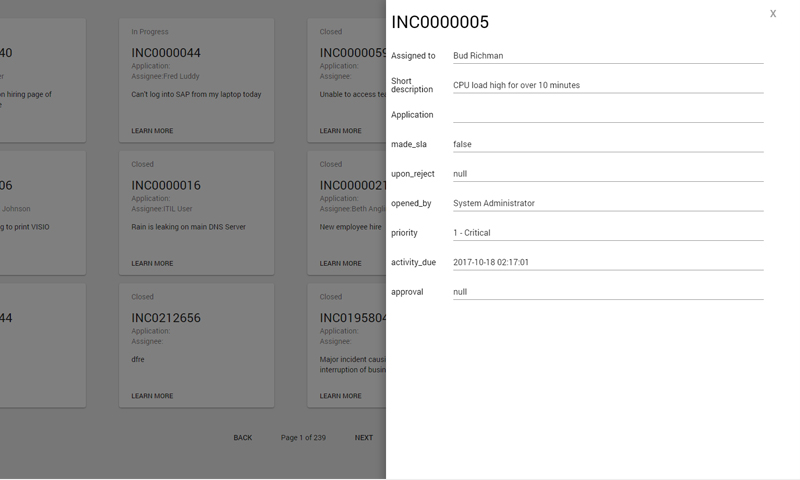
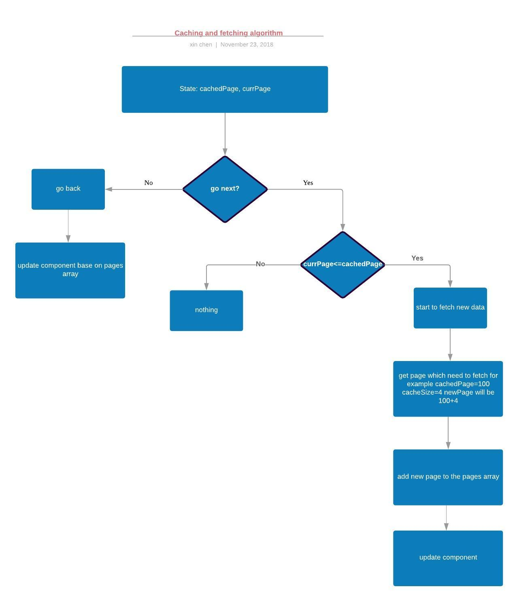

# Paginate Cache Project

This project displays a paginated set of card data on your page and allow the user to change pages to see all the available cards.

### Installing

Clone the repo from git to your local folder

```
git clone https://github.com/BubbleKID/paginate-cache.git
```

then use NPM to install the dependencies

```
npm install
```

## Running the tests

This project using unit testing (Enzyme + Jest)

```
npm run test
```
## Screenshots




## Caching and fetching	algorithm



## Built With

* [Creat React App](https://facebook.github.io/create-react-app/) - To scaffold the project.
* [Material-UI](https://material-ui.com/) - UI framework
* [Redux](https://redux.js.org/) - To manage application state.

## Authors

* **Xin Chen** - *Initial work* - [BubbleKID](https://github.com/BubbleKID/)
